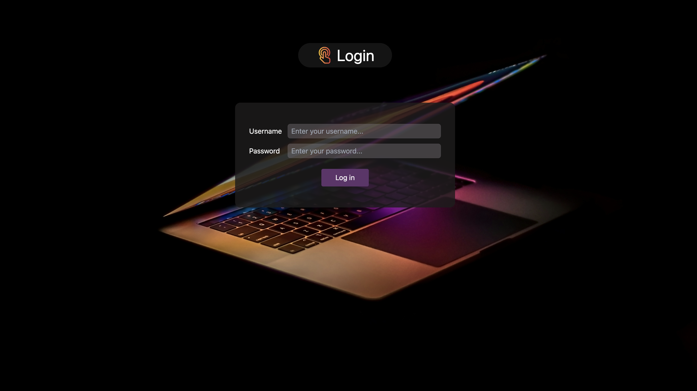
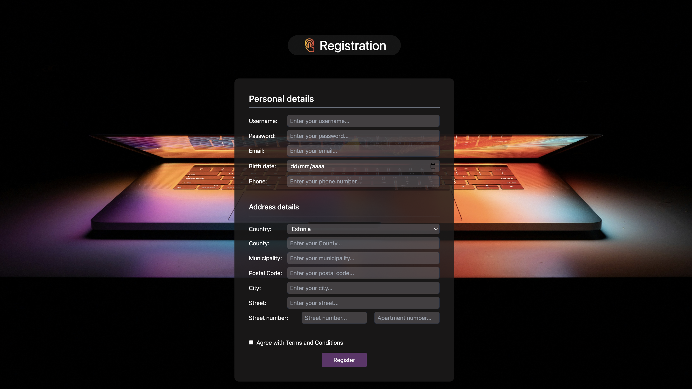
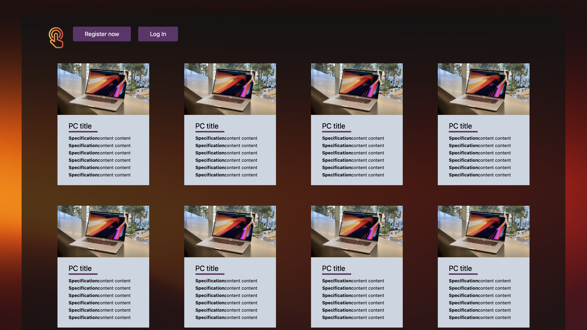

#  PC rent platform

   
   
  

## Welcome!

This is a responsive PC rent app, created using:
- backend - node.js, mySQL nginx
- frontned - react vite, tailwind, css

## Getting Started

### Prerequisites

Before you begin, ensure you have the following installed on your machine:

- Node.js: [Download here](https://nodejs.org/)
- npm (Node Package Manager): Comes with Node.js installation
- mySQL
- nginx

+ env file

###  Installed dependencies

- backend:
`npm install --save mysql2`
`npm i express`
`npm i express-session`
`npm i express-mysql-session`
`npm i multer`
`npm install dotenv`

- frontend:
`npm install`
`npm install react-router-dom localforage match-sorter sort-by`
`npm install react-icons`
tailwind

### Viewing the App
Once the dependencies are installed, you can start the development server and run the app:  frontend - `npm run dev` backend `node index` or if installed `nodemon`

### License
This project is licensed under the MIT License - see the LICENSE file for details. Intention is that you can use everything in this project as a starting point or as a bits and pieces in your own project.

  
    
      
        

