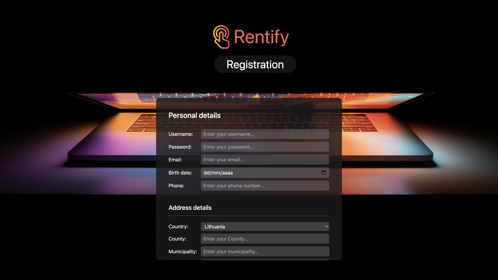
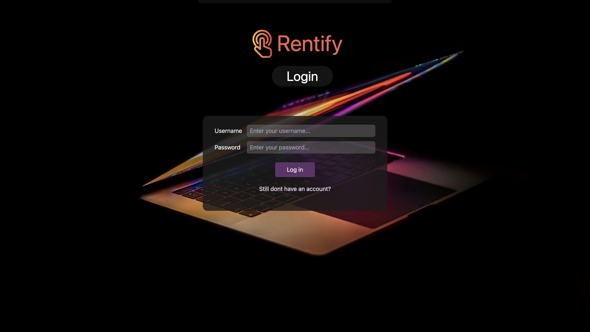
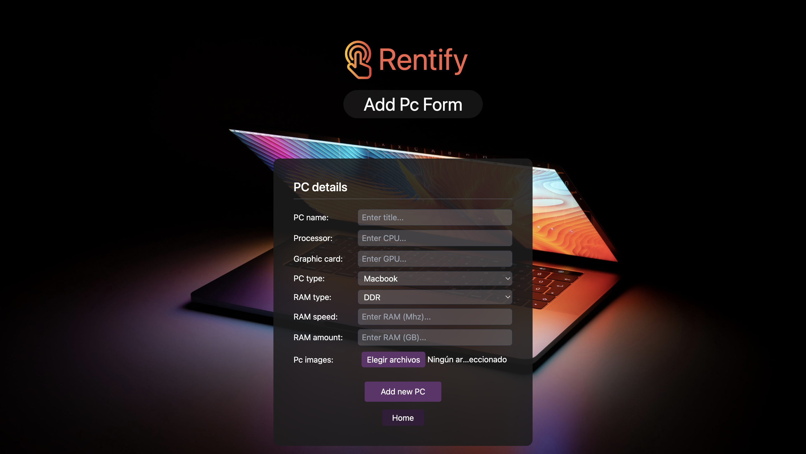
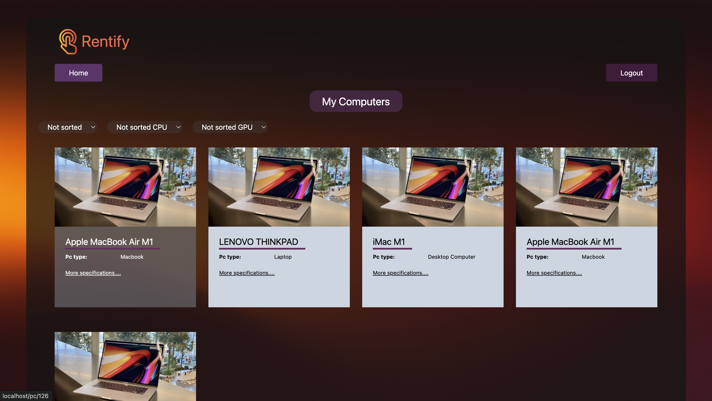
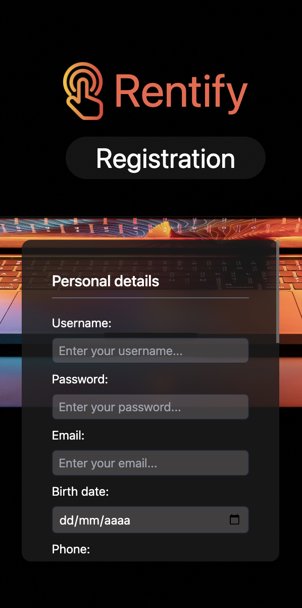
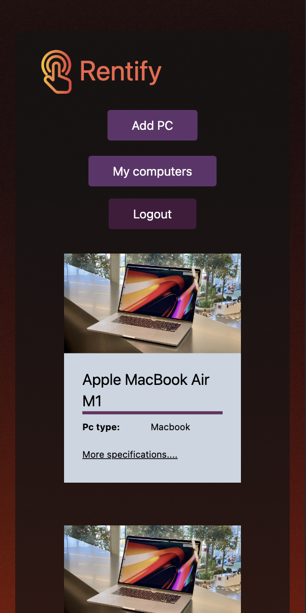
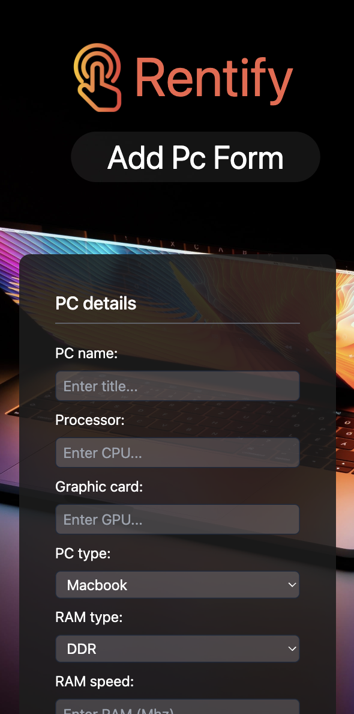
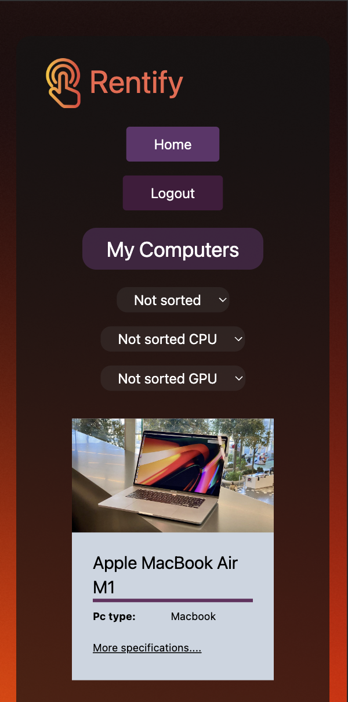
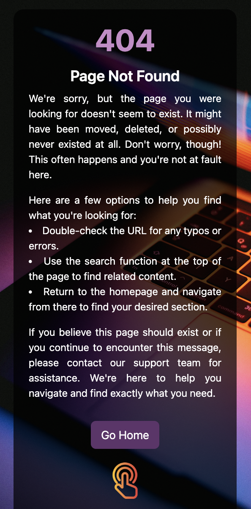

# <span></span> Rentify - PC rent platform

<div>
   
   
  
</div>

## Welcome!

This is a responsive PC rent app, created using:
- backend - node.js, mySQL nginx;
- frontned - react vite, tailwind, css;

## Getting Started

### Prerequisites

Before you begin, ensure you have the following installed on your machine:

- Node.js (v20.10.0 or later): [Download here](https://nodejs.org/);
- npm (Node Package Manager): Comes with Node.js installation;
- mySQL;
- NGINX;

## Installation

1. Clone this repository to your local machine;
2. Navigate to the project directory;
3. Navigate to "backend" and add "env" file;

#### Add `.env` file

- Create a new file named `.env` in the "backend" directory.

- To do it propertly copy this code and paste it to your newly created .env file.

### `.env`

```
DB_HOST="localhost"
DB_USER="root"
DB_PASSWORD="your_password"
DB_DATABASE="pc_rent_platform"
```

4. Install tailwind;
5. Install dependencies;

#### backend:
 - `npm install --save mysql2`
 - `npm i express`
 - `npm i express-session`
 - `npm i express-mysql-session`
 - `npm i multer`
 - `npm install dotenv`

#### frontend:
- `npm install`
- `npm install react-router-dom localforage match-sorter sort-by`
- `npm install react-icons`


## Viewing the App
Once the dependencies are installed, you can start the development server and run the app:  frontend - `npm run dev` backend `node index` or if installed `nodemon`.

## Todo

As this project is on going there is a lot more left that needs to be worked on, so this is not a resource for production ready workflow ideas or systems.

Some of the things/functions left to do:

- Fix PC addition;
- Update/Delete PC;
- Renting functionality;
- Change Password...

## License
This project is licensed under the MIT License - see the LICENSE file for details. Intention is that you can use everything in this project as a starting point or as a bits and pieces in your own project.


### Desktop version:
<div>
  
  
  
  
  
  
  
  

### Mobile version:
  
  
  
  
  
  
  
  
</div>


